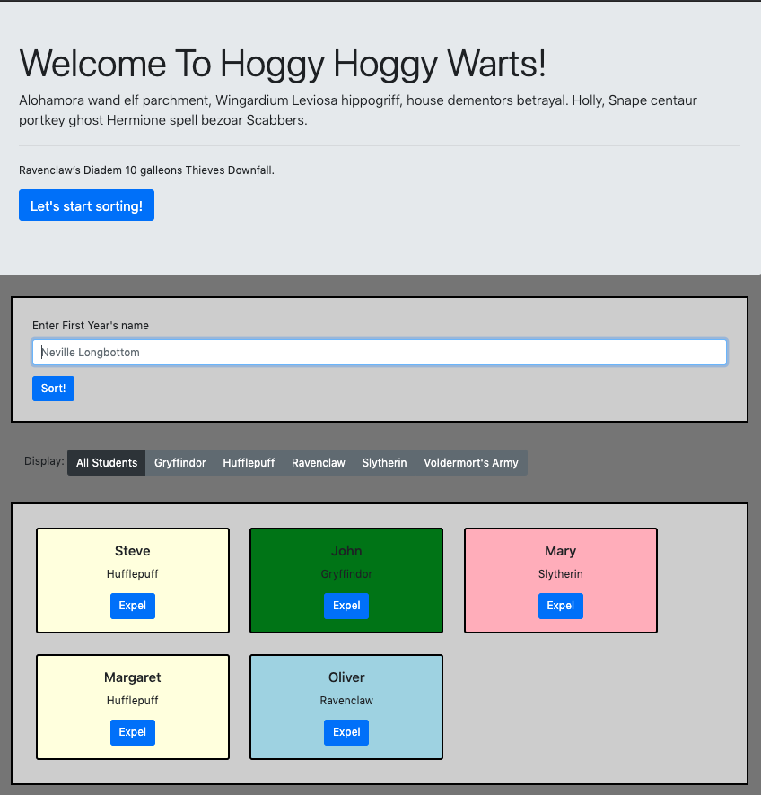

# Sorting Hat
This Hogwarts-themed web app will randomly assign a student to one of four houses (Gryffindor, Hufflepuff, Ravenclaw, or Slytherin) and will display a card for each student. Each card contains a student's name and their assigned house. The user can expel a student, thereby sending him/her to Voldermort's Army. A user can also choose to filter the display via a row of six buttons, which will show only the student(s) in the house they select.

This was built as an assignement to learn to use [Bootstrap 4](https://getbootstrap.com/docs/4.0/getting-started/introduction/) and responsive design.

## Features
* Card colors are cordinated by houses
* The site is responsive and will adjust display according to screen size

## Screenshot

## Installation
* Clone this repo to your local machine using `https://github.com/petestewart72/sorting-hat`
* Run in any http server with `$ hs`

## Contributors
* [Pete Stewart](https://github.com/petestewart72)

## Technologies Used
  

